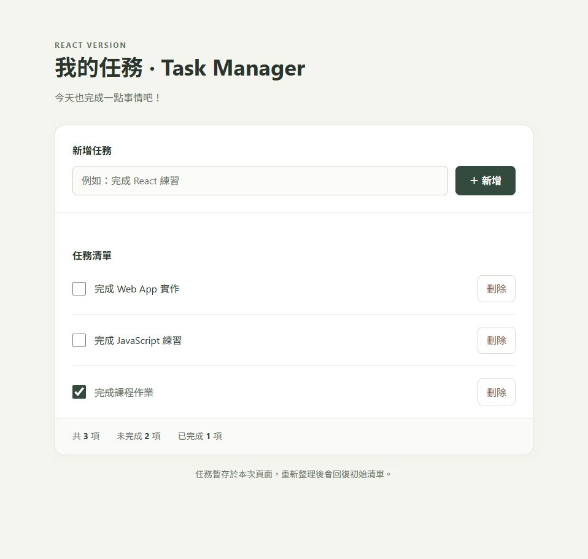
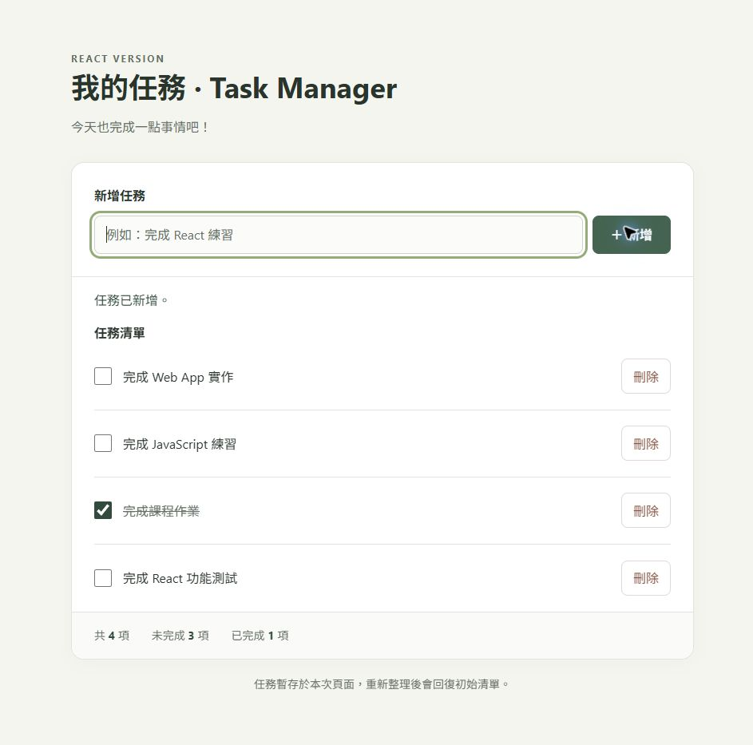
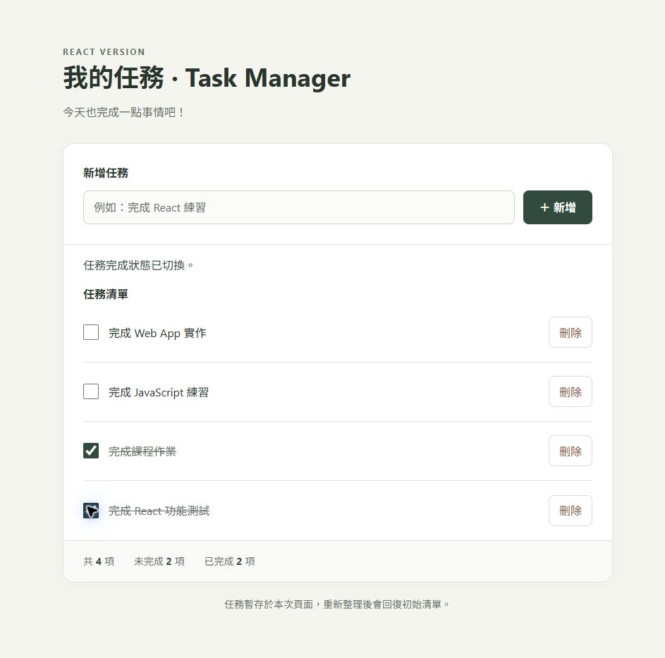
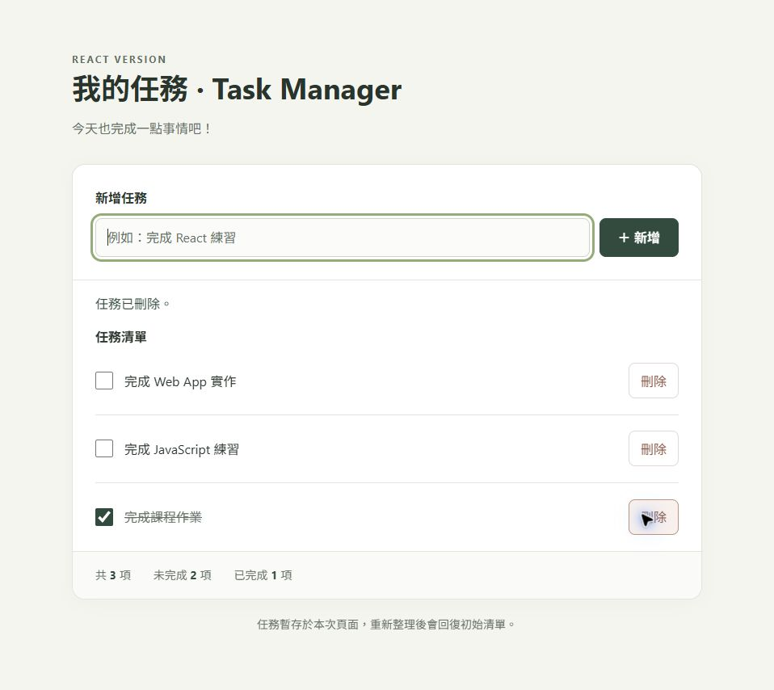
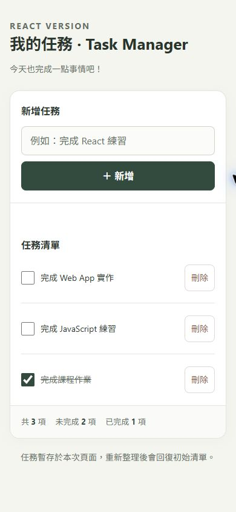

# React 功能測試紀錄

測試日期：2026-10-04（Asia/Taipei）。以 Chrome 實際操作本機 Vite 頁面，並檢查渲染後的 DOM 與統計。此紀錄為本次操作驗證，不是自動化測試套件。

| 案例 | 操作與預期結果 | 實際結果 |
| --- | --- | --- |
| 初始載入 | 顯示三筆任務，總數／未完成／已完成為 3／2／1 | PASS |
| 空字串 | 點新增，顯示不能輸入空白且不新增 | PASS，維持三筆 |
| 純空白 | 輸入空格後新增，不新增 | PASS，維持三筆 |
| 新增任務 | 輸入「  完成 React 功能測試  」，去除頭尾空白並立即顯示 | PASS，統計 4／3／1、輸入框清空 |
| 完成任務 | 勾選新增任務，立即顯示完成樣式與更新統計 | PASS，統計 4／2／2 |
| 取消完成 | 再點選同一任務，恢復未完成 | PASS，統計 4／3／1 |
| 刪除任務 | 刪除新增任務，其他任務保留 | PASS，統計 3／2／1 |
| 空清單 | 刪除所有任務 | PASS，顯示空清單提示、統計 0／0／0 |
| Enter 新增 | 空清單輸入任務並按 Enter | PASS，不重載頁面，立即新增 |
| 同名任務 | 新增兩筆同名任務，刪除其中一筆 | PASS，只移除指定一筆 |
| 特殊字元 | 新增 <b>文字測試</b> | PASS，顯示原文字串，沒有產生 HTML 標籤 |
| 手機版 | 390px viewport | PASS，沒有水平溢出 |
| 正式建置 | npm run build | PASS，產生 dist |
| 執行錯誤 | 檢查本 React 頁面的 error 紀錄 | 未發現應用程式錯誤 |

## 畫面證據

### 初始畫面（Checkpoint 5-1）

### 新增後（Checkpoint 5-2，與初始畫面比較）

### 完成後（Checkpoint 5-3，與新增後比較）

### 刪除後（Checkpoint 5-4）

先取消新增任務的完成狀態，再刪除該筆任務，回到原始三筆清單。

### 手機畫面

## 限制

資料未持久化，重新整理會回復初始任務。
